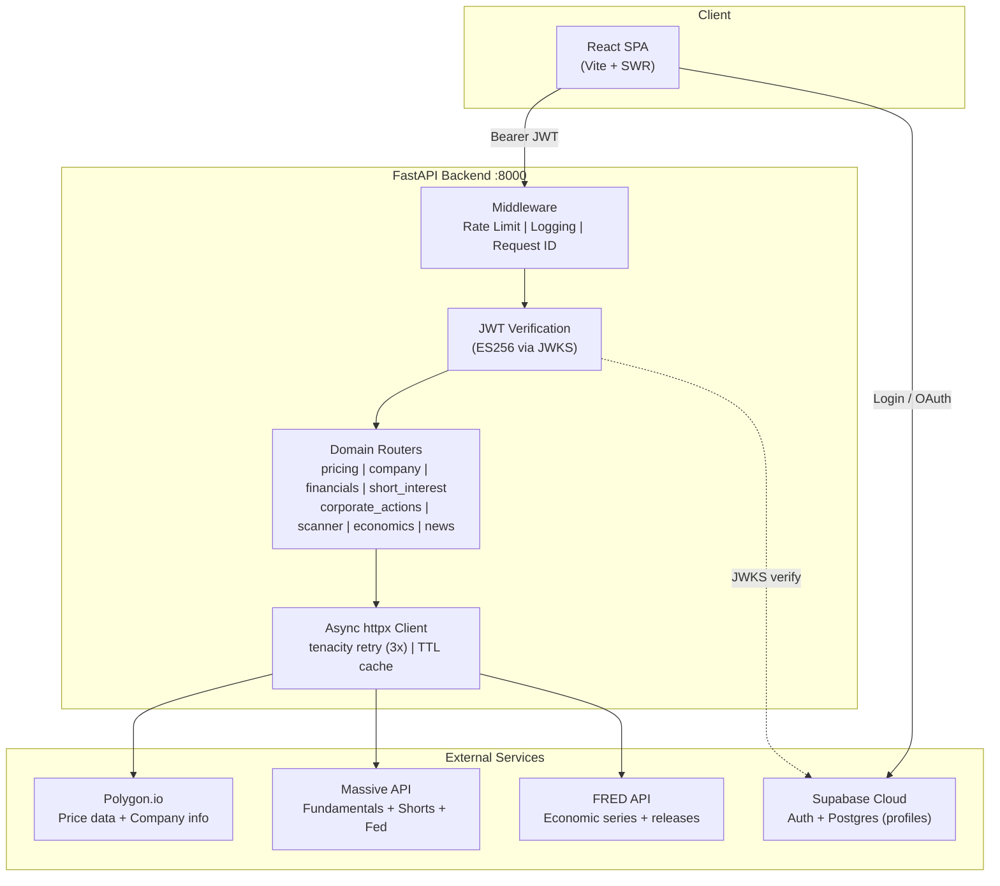

# 3Epsilon AI

> This project is almost entirely written by AI (Claude, Cursor, etc.). For details on how the AI tooling is configured, see the `[harness/](harness/)` directory.

A financial research terminal built with React 19 + Vite and FastAPI. Real-time market data, company research, financial statements, short interest analysis, economic indicators, and an AI-powered chat interface — all behind invite-only Supabase Auth.

## Architecture




## Features

- **AI Chat Terminal** — Conversational research interface with LLM tool use, SSE streaming, and a persistent widget canvas (Together AI)
- **Market Overview** — Global indices, real-time quotes, economic indicators, upcoming events
- **Company Research** — Price charts (7 timeframes), company profiles, financial statements, ratios
- **Short Interest** — Short interest data, short volume, free float analysis
- **Corporate Actions** — Dividend history, stock splits, upcoming events, recent IPOs
- **Inside Day Scanner** — Technical pattern detection with compression analysis
- **Global Economics** — World Bank choropleth maps, FRED economic series, IMF data
- **News** — Company-specific and market-wide news feeds
- **Prediction Markets** — Polymarket event data

## Tech Stack


| Layer         | Technology                                                |
| ------------- | --------------------------------------------------------- |
| Frontend      | React 19 + TypeScript + Vite 7                            |
| Data Fetching | SWR (caching, dedup, revalidation)                        |
| Styling       | Tailwind CSS                                              |
| Backend       | FastAPI + Python 3.13                                     |
| HTTP          | httpx (async) + tenacity (retry) + cachetools (TTL cache) |
| Auth          | Supabase Auth (invite-only, ES256 JWKS)                   |
| LLM           | Together AI (tool use + SSE streaming)                    |
| Rate Limiting | slowapi (60 req/min)                                      |
| CI            | GitHub Actions (pytest + ruff, vitest + tsc)              |


## Getting Started

### Prerequisites

- Python 3.12+
- Node.js 22+
- [uv](https://docs.astral.sh/uv/) (Python package manager)

### Quick Start

```bash
just setup       # install backend + frontend dependencies
just dev         # run both dev servers concurrently
```

Or run individually:

```bash
just dev-backend    # backend only (port 8000)
just dev-frontend   # frontend only (port 5173)
```

### Manual Setup

**Backend:**

```bash
cd backend
cp .env.example .env   # fill in your API keys
uv sync --group dev
source .venv/bin/activate
uvicorn app.main:app --reload
```

**Frontend:**

```bash
cd frontend
cp .env.example .env   # fill in Supabase + API URL
npm install --legacy-peer-deps
npm run dev
```

### Environment Variables

**Backend** (`backend/.env`):


| Variable           | Required | Description                           |
| ------------------ | -------- | ------------------------------------- |
| `MASSIVE_API_KEY`  | Yes      | API key for Polygon.io + Massive      |
| `FRED_API_KEY`     | Yes      | API key for FRED economic data        |
| `TOGETHER_API_KEY` | Yes      | API key for Together AI LLM (chat)    |
| `SUPABASE_URL`     | Yes      | Supabase project URL                  |
| `DEBUG`            | No       | FastAPI debug mode (default: `false`) |


**Frontend** (`frontend/.env`):


| Variable                 | Required | Description                                |
| ------------------------ | -------- | ------------------------------------------ |
| `VITE_API_BASE_URL`      | Yes      | Backend URL (e.g. `http://localhost:8000`) |
| `VITE_SUPABASE_URL`      | Yes      | Supabase project URL                       |
| `VITE_SUPABASE_ANON_KEY` | Yes      | Supabase anon/publishable key              |


## Project Structure

```
argus/
├── backend/
│   └── app/
│       ├── api/v1/              # API version aggregator
│       ├── core/                # Config, auth, middleware, rate limiting
│       ├── shared/              # Async HTTP client, response schemas
│       └── domains/             # DDD modules
│           ├── pricing/         # Price charts, quotes, indices
│           ├── company/         # Company profiles, search
│           ├── financials/      # Income statements, balance sheets, cash flow, ratios
│           ├── short_interest/  # Short interest, short volume, float
│           ├── corporate_actions/ # Dividends, splits, IPOs
│           ├── news/            # Company + market news
│           ├── scanner/         # Inside day pattern detection
│           ├── economics/       # Economic indicators + events
│           ├── fred/            # FRED API client (internal, used by economics)
│           ├── chat/            # LLM orchestration, tool registry, SSE streaming
│           ├── filings/         # SEC filings
│           ├── polymarket/      # Prediction markets
│           └── imf/             # International macro data
├── frontend/
│   └── src/
│       ├── components/          # UI components by feature
│       ├── hooks/               # SWR data-fetching hooks
│       ├── lib/                 # API client, SWR config, utils
│       ├── contexts/            # Auth context
│       └── types/               # TypeScript interfaces
├── harness/                     # AI & editor config (Claude, Cursor, etc.)
├── project-docs/                # Architecture, decisions, infrastructure
├── api/                         # Vercel serverless entry point
└── .github/workflows/           # CI pipeline
```

## API

All endpoints at `/api/v1/` (and `/api/` for backward compat). Interactive docs at `/api/v1/docs`.

All data endpoints require a valid Supabase JWT. Only `/api/health` is public.


| Endpoint                                      | Domain            | Source            |
| --------------------------------------------- | ----------------- | ----------------- |
| `GET /pricing/price-chart?ticker=&timeframe=` | pricing           | Polygon.io        |
| `GET /pricing/quotes?tickers=`                | pricing           | Polygon.io        |
| `GET /pricing/market-indices`                 | pricing           | Mock data         |
| `GET /company/details?ticker=`                | company           | Polygon.io        |
| `GET /financials/income-statement?ticker=`    | financials        | Massive API       |
| `GET /financials/balance-sheet?ticker=`       | financials        | Massive API       |
| `GET /financials/cash-flow?ticker=`           | financials        | Massive API       |
| `GET /financials/ratios?ticker=`              | financials        | Massive API       |
| `GET /short-interest/short-interest?ticker=`  | short_interest    | Massive API       |
| `GET /short-interest/short-volume?ticker=`    | short_interest    | Massive API       |
| `GET /short-interest/float?ticker=`           | short_interest    | Massive API       |
| `GET /corporate-actions/dividends?ticker=`    | corporate_actions | Polygon.io        |
| `GET /corporate-actions/splits?ticker=`       | corporate_actions | Polygon.io        |
| `GET /corporate-actions/upcoming-splits`      | corporate_actions | Polygon.io        |
| `GET /corporate-actions/upcoming-dividends`   | corporate_actions | Polygon.io        |
| `GET /corporate-actions/recent-ipos`          | corporate_actions | Massive API       |
| `GET /news?ticker=`                           | news              | Polygon.io        |
| `GET /news/market`                            | news              | Polygon.io        |
| `GET /inside-days?ticker=`                    | scanner           | Polygon.io        |
| `GET /scan-inside-days`                       | scanner           | Polygon.io        |
| `GET /economic-data`                          | economics         | FRED + Massive    |
| `GET /upcoming-events`                        | economics         | FRED              |
| `POST /chat/message`                          | chat              | Together AI (SSE) |


## Testing

```bash
# Backend
cd backend && python3 -m pytest tests/ -v

# Frontend
cd frontend && npx vitest run
```

## Documentation

- `[project-docs/ARCHITECTURE.md](project-docs/ARCHITECTURE.md)` — System overview, DDD structure, data flow diagrams
- `[project-docs/DECISIONS.md](project-docs/DECISIONS.md)` — Architectural Decision Records (ADRs)
- `[project-docs/INFRASTRUCTURE.md](project-docs/INFRASTRUCTURE.md)` — Deployment, Vercel config, CI/CD
- `[project-docs/AI-CHAT-TERMINAL.md](project-docs/AI-CHAT-TERMINAL.md)` — AI chat terminal feature plan
- `[project-docs/argus-style-guide.md](project-docs/argus-style-guide.md)` — Design system and style guide
- `[harness/](harness/)` — AI & editor configuration (Claude Code, Cursor, OpenCode)

