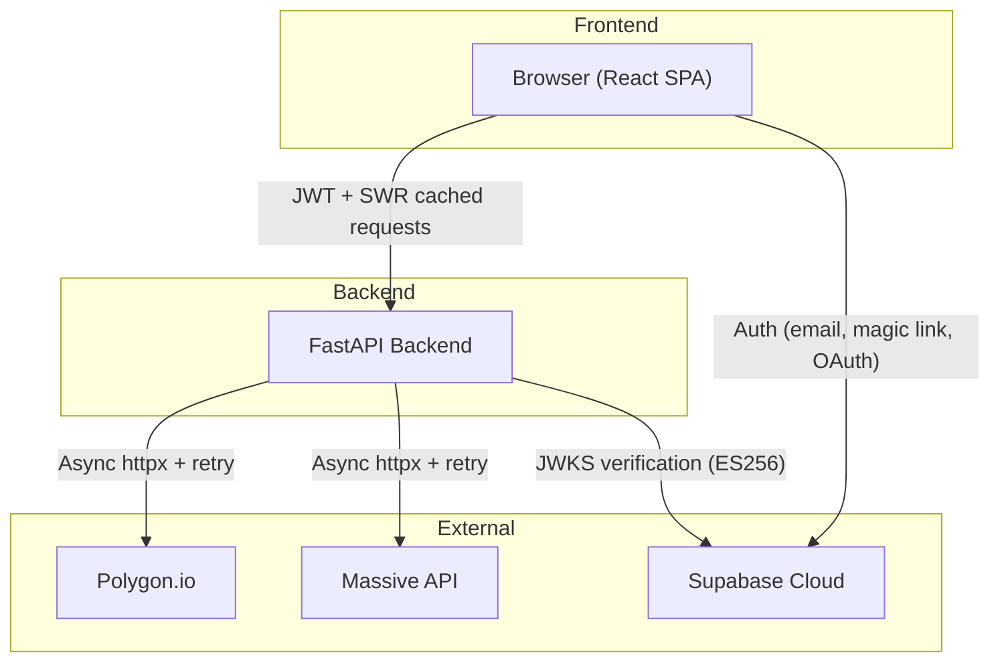

# Finance Dashboard

`This is pretty much all written by AI`

A Bloomberg terminal-inspired finance dashboard built with React 19 + Vite and FastAPI. Real-time market data, company research, financial statements, and technical pattern scanners — all behind invite-only auth.

## Architecture



## Features

- **Market Overview** — Global indices, economic indicators, upcoming events
- **Company Research** — Price charts (7 timeframes), company details, financial statements
- **Fundamentals** — Income statements, balance sheets, cash flow, ratios, short interest, float
- **Inside Day Scanner** — Technical pattern detection with compression analysis
- **Global Economics** — World Bank choropleth maps with GDP, unemployment, inflation data

## Tech Stack

| Layer | Technology |
|-------|-----------|
| Frontend | React 19 + TypeScript + Vite 7 |
| Data Fetching | SWR (caching, dedup, revalidation) |
| Styling | Tailwind CSS |
| Backend | FastAPI + Python 3.12+ |
| HTTP | httpx (async) + tenacity (retry) + cachetools (TTL cache) |
| Auth | Supabase Auth (invite-only, ES256 JWKS) |
| Rate Limiting | slowapi (60 req/min) |
| CI | GitHub Actions (pytest + ruff, vitest + tsc) |

## Getting Started

### Prerequisites

- Python 3.12+
- Node.js 22+
- [uv](https://docs.astral.sh/uv/) (Python package manager)

### Backend

```bash
cd backend
cp .env.example .env   # fill in your API keys
uv sync --group dev
source .venv/bin/activate
uvicorn app.main:app --reload
```

### Frontend

```bash
cd frontend
cp .env.example .env   # fill in Supabase + API URL
npm install --legacy-peer-deps
npm run dev
```

### Environment Variables

**Backend** (`backend/.env`):
| Variable | Description |
|----------|-------------|
| `MASSIVE_API_KEY` | API key for Polygon.io + Massive |
| `SUPABASE_URL` | Supabase project URL |
| `DEBUG` | FastAPI debug mode (default: `false`) |

**Frontend** (`frontend/.env`):
| Variable | Description |
|----------|-------------|
| `VITE_API_BASE_URL` | Backend URL (e.g. `http://localhost:8000`) |
| `VITE_SUPABASE_URL` | Supabase project URL |
| `VITE_SUPABASE_ANON_KEY` | Supabase anon/publishable key |

## Project Structure

```
finance-dashboard/
├── backend/
│   └── app/
│       ├── api/v1/          # API version aggregator
│       ├── core/            # Config, auth, middleware, rate limiting
│       ├── shared/          # Async HTTP client, response schemas
│       ├── domains/         # DDD modules (see below)
│       │   ├── market/      # Indices + price charts
│       │   ├── research/    # Company details
│       │   ├── fundamentals/# Financial statements, ratios, shorts
│       │   ├── scanner/     # Inside day detection
│       │   └── economics/   # Economic data + events
│       └── data/            # Mock data
├── frontend/
│   └── src/
│       ├── components/      # UI components by feature
│       ├── hooks/           # SWR data-fetching hooks
│       ├── lib/             # API client, SWR config, utils
│       ├── contexts/        # Auth context
│       └── types/           # TypeScript interfaces
├── api/                     # Vercel serverless entry point
├── project-docs/            # Architecture, decisions, infrastructure
└── .github/workflows/       # CI pipeline
```

## API

All endpoints available at `/api/v1/` (and `/api/` for backward compat).

Interactive docs at `/api/v1/docs` when running locally.

| Endpoint | Domain | Source |
|----------|--------|--------|
| `GET /market-indices` | market | Mock data |
| `GET /price-chart?ticker=&timeframe=` | market | Polygon.io |
| `GET /company/details?ticker=` | research | Polygon.io |
| `GET /fundamentals/{type}?ticker=` | fundamentals | Massive API |
| `GET /inside-days?ticker=` | scanner | Polygon.io |
| `GET /economic-data` | economics | Mock data |
| `GET /upcoming-events` | economics | Mock data |

All data endpoints require a valid Supabase JWT.

## Testing

```bash
# Backend
cd backend && python3 -m pytest tests/ -v

# Frontend
cd frontend && npx vitest run
```

## Documentation

- [`project-docs/ARCHITECTURE.md`](project-docs/ARCHITECTURE.md) — System overview, DDD structure, data flow diagrams
- [`project-docs/DECISIONS.md`](project-docs/DECISIONS.md) — Architectural Decision Records (ADRs)
- [`project-docs/INFRASTRUCTURE.md`](project-docs/INFRASTRUCTURE.md) — Deployment, Vercel config, CI/CD
