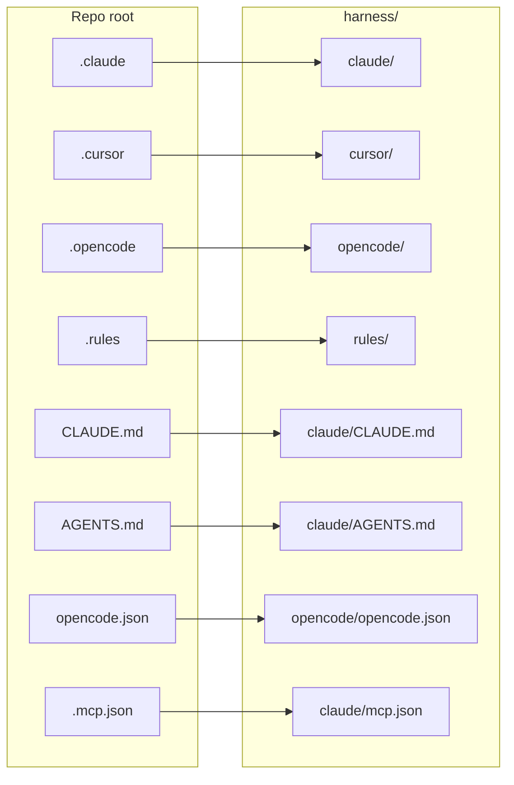
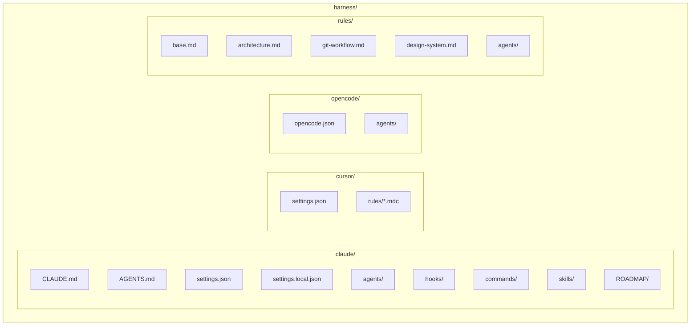
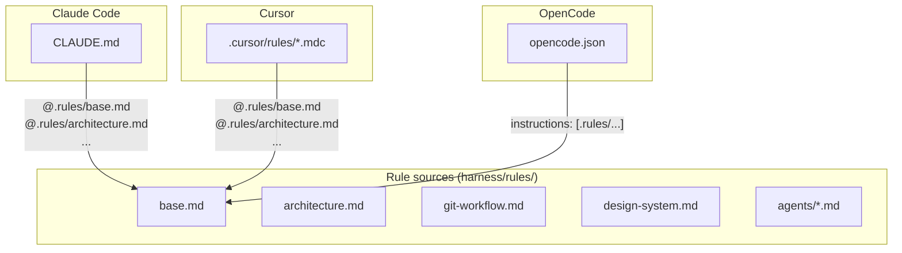
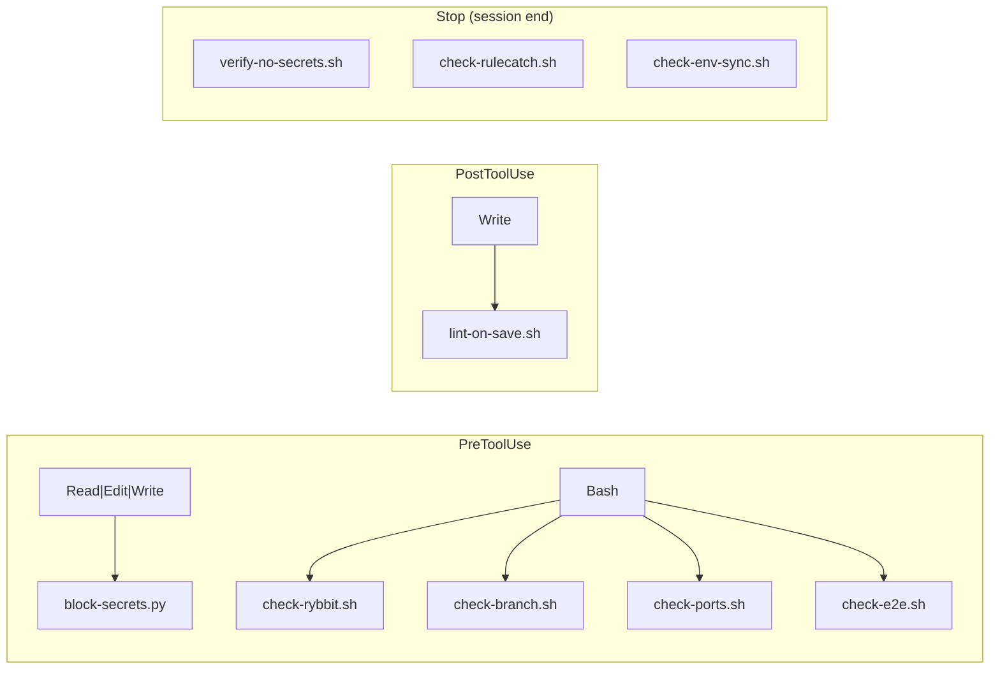
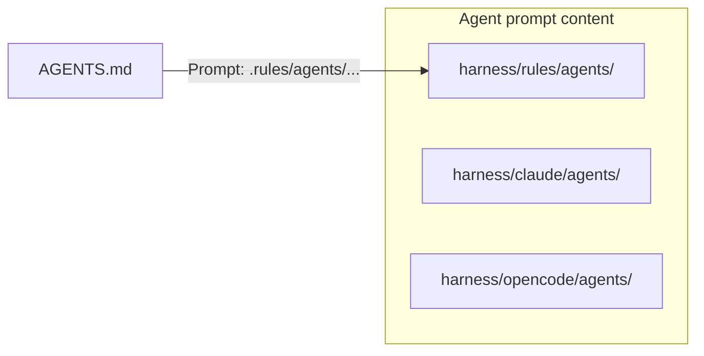

# Harness — AI / Editor Configuration

This directory holds **all AI and editor configuration in one place**. The repo root expects these paths (e.g. `.claude`, `.cursor`, `CLAUDE.md`). The `setup-harness.sh` script at repo root creates **symlinks** from the root into `harness/`, so tools see the same paths while the real files live here.

---

## Quick start

From the **repository root** (not inside `harness/`):

```bash
./setup-harness.sh
```

This creates the symlinks. Run it after cloning or whenever those links are missing.

---

## How the harness is mapped

### Symlink layout

Everything under `harness/` is exposed at the repo root via symlinks. No tool config lives at root; it all points here.



| At repo root (symlink) | Points to (in harness/) |
|------------------------|--------------------------|
| `.claude`              | `harness/claude`         |
| `.cursor`             | `harness/cursor`         |
| `.opencode`           | `harness/opencode`       |
| `.rules`              | `harness/rules`          |
| `CLAUDE.md`           | `harness/claude/CLAUDE.md` |
| `AGENTS.md`           | `harness/claude/AGENTS.md` |
| `opencode.json`       | `harness/opencode/opencode.json` |
| `.mcp.json`           | `harness/claude/mcp.json`        |

---

## Directory structure (harness/)



| Directory   | Purpose |
|------------|---------|
| **harness/claude/** | Claude Code (Claude.dev) config: entrypoints, permissions, hooks, skills, agents, commands, ROADMAP. |
| **harness/cursor/** | Cursor IDE config: workspace settings and rule files (`.mdc`) that reference `.rules/`. |
| **harness/opencode/** | OpenCode config: `opencode.json` instructions and optional agents. |
| **harness/rules/**   | Canonical project rules (Markdown) used by CLAUDE.md, Cursor rules, and OpenCode. |

---

## How tools consume the rules

All three surfaces (Claude, Cursor, OpenCode) use the **same** rule content under `.rules/` (i.e. `harness/rules/`). The flow looks like this:



- **CLAUDE.md** (repo root → `harness/claude/CLAUDE.md`) includes `@.rules/base.md`, `@.rules/architecture.md`, etc., so Claude loads those files when resolving the `@` refs (and `.rules` is the symlink to `harness/rules`).
- **Cursor** `.mdc` files under `.cursor/rules/` (→ `harness/cursor/rules/`) use the same `@.rules/...` references, so Cursor loads the same Markdown from `harness/rules/`.
- **OpenCode** `opencode.json` lists the same paths in `instructions`; they are resolved relative to repo root, so again they point at `harness/rules/` via the `.rules` symlink.

---

## Claude hooks (when they run)

Claude Code uses `harness/claude/settings.json` (exposed as `.claude/settings.json`). Hooks run at different phases and reference scripts under `.claude/hooks/` (i.e. `harness/claude/hooks/`).



| Phase       | Matcher        | Hooks |
|------------|----------------|--------|
| **PreToolUse** | `Read\|Edit\|Write` | `block-secrets.py` (avoid touching secrets) |
| **PreToolUse** | `Bash`         | `check-rybbit.sh`, `check-branch.sh`, `check-ports.sh`, `check-e2e.sh` |
| **PostToolUse** | `Write`      | `lint-on-save.sh` |
| **Stop**   | (all)          | `verify-no-secrets.sh`, `check-rulecatch.sh`, `check-env-sync.sh` |

All hook paths in settings use `.claude/hooks/...`; with `.claude` → `harness/claude`, they resolve to `harness/claude/hooks/`.

---

## Agents (code-reviewer, test-writer)

Agent **prompts** live in multiple places; they are intended to stay in sync:



- **AGENTS.md** (→ `harness/claude/AGENTS.md`) lists available agents and points to **`.rules/agents/<name>.md`** for the prompt body.
- The same agent names (e.g. `code-reviewer`, `test-writer`) may have parallel files under `harness/claude/agents/` and `harness/opencode/agents/` for tool-specific use; the canonical prompt used by AGENTS.md is under **harness/rules/agents/**.

Keep `harness/rules/agents/*.md` as the source of truth for what the agents do; duplicate agent dirs can mirror or extend that as needed.

---

## Summary

| Concept | Detail |
|--------|--------|
| **Single source of truth** | All AI/editor config lives under `harness/`. |
| **Repo root** | Only symlinks (and `setup-harness.sh`). Run `./setup-harness.sh` to create them. |
| **Rules** | `harness/rules/` is the canonical rules dir; CLAUDE.md, Cursor `.mdc`, and OpenCode all reference it via `.rules/`. |
| **Claude** | Entrypoints and hooks live in `harness/claude/`; hooks use paths like `.claude/hooks/...` (resolved via symlink). |
| **Cursor** | Settings and rule refs in `harness/cursor/`; rules use `@.rules/...` to load `harness/rules/`. |
| **OpenCode** | Config in `harness/opencode/opencode.json`; instructions point at `.rules/...`. |

If a path is documented as `.claude`, `.cursor`, `.rules`, or `CLAUDE.md` / `AGENTS.md` / `opencode.json` at repo root, it is a symlink into this harness.
