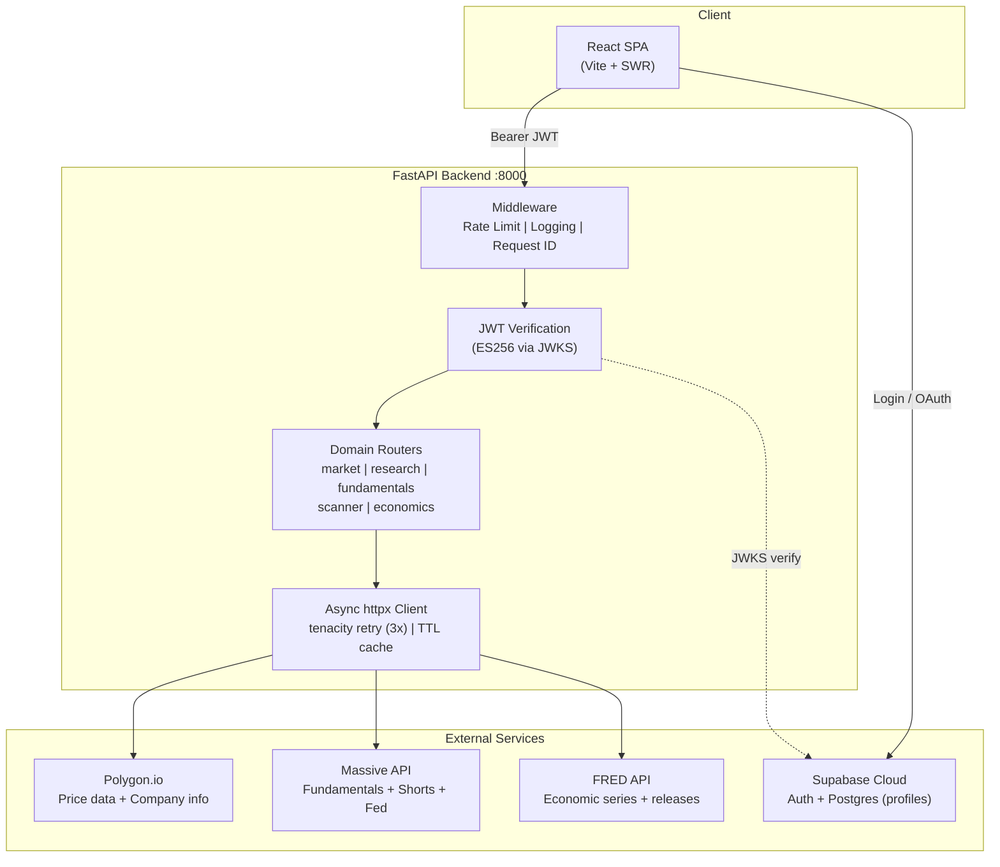
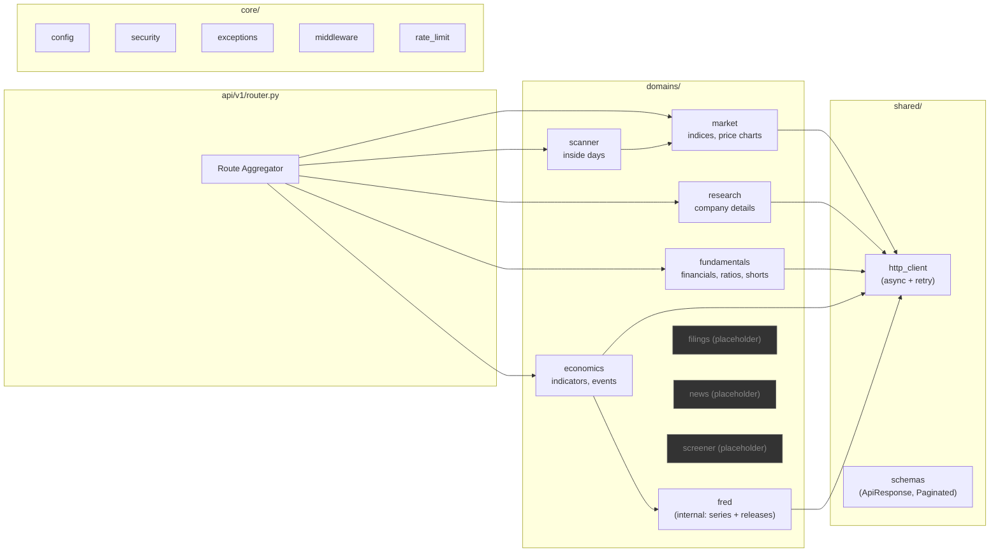
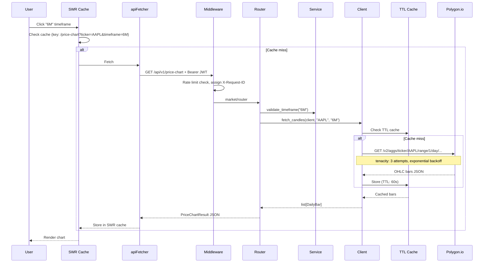
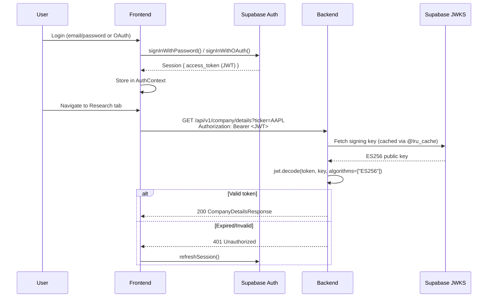
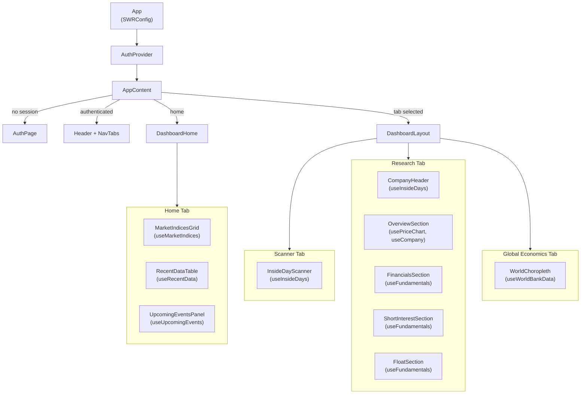

# Architecture

> **This document is AUTHORITATIVE. No exceptions.**
> Read this before making cross-service changes.

---

## Overview

Finance Dashboard is a two-tier web application: a **React + Vite** frontend and a **FastAPI** backend. The backend proxies two external market-data APIs (Polygon.io and Massive) and serves the results over a REST JSON API. **Supabase Auth** handles user authentication — the frontend gates all content behind login, and the backend verifies JWTs on every API request. User profiles are stored in a Supabase Postgres `profiles` table with Row Level Security.



---

## Backend Structure — Domain-Driven Design

The backend uses **Domain-Driven Design (DDD)** where each business domain is a self-contained module:



### Directory Layout

```
backend/app/
├── api/v1/router.py         # Aggregates all domain routers under /api/v1
├── core/
│   ├── config.py            # Settings + get_settings() with @lru_cache
│   ├── security.py          # JWT verification (ES256 via JWKS)
│   ├── exceptions.py        # AppException hierarchy + global handler
│   ├── middleware.py         # Request logging + X-Request-ID
│   └── rate_limit.py        # slowapi (60 req/min)
├── shared/
│   ├── http_client.py       # Async httpx + tenacity retry
│   └── schemas.py           # ApiResponse[T], PaginatedResponse[T]
├── domains/
│   ├── market/              # router, schemas, service, client
│   ├── research/            # router, schemas, service, client
│   ├── fundamentals/        # router, schemas, service, client
│   ├── scanner/             # router, schemas, service
│   ├── economics/           # router, schemas, service, client
│   ├── fred/                # client, service (internal — consumed by economics)
│   ├── filings/             # placeholder
│   ├── news/                # placeholder
│   └── screener/            # placeholder
├── data/mock_data.py
└── main.py
```

### Adding a New Domain

1. Create `backend/app/domains/<name>/` with `__init__.py`, `router.py`, `schemas.py`, `service.py`, `client.py`
2. Add router import in `backend/app/api/v1/router.py`
3. Add corresponding frontend hook + component
4. Zero changes to existing domains

---

## Data Flow

### Request Lifecycle



### Authentication Flow



---

## Frontend Architecture

### Component Tree



### SWR Hook Pattern

All data-fetching hooks follow the same pattern:

```typescript
useSWR<T>(key | null, apiFetcher) → { data, error, isLoading }
```

SWR provides: request deduplication, in-memory caching, stale-while-revalidate, automatic error retry, and focus revalidation (disabled by default).

---

## Services

### Frontend — React + Vite (port 5173)

| Does | Does NOT |
|------|----------|
| Render dashboard UI (Overview, Scanner, Research, Global Economics) | Store any persistent data |
| Cache + deduplicate requests via SWR | Perform server-side rendering |
| Call backend REST API via `apiFetcher` | Call external APIs directly |
| Handle timeframe/tab/section navigation | |
| Authenticate users via Supabase Auth | |

**Key paths:**
- `src/App.tsx` — Root component (SWRConfig > AuthProvider > Router)
- `src/lib/swr.ts` — SWR global config, typed fetcher with envelope unwrapping
- `src/lib/api.ts` — Named API methods (convenience wrappers)
- `src/hooks/` — SWR-based data-fetching hooks (one per API resource)
- `src/types/index.ts` — Shared TypeScript interfaces + ApiResponse envelope
- `src/components/ui/ErrorBoundary.tsx` — React error boundary
- `src/components/ui/Skeleton.tsx` — Loading skeleton variants

### Backend — FastAPI (port 8000)

| Does | Does NOT |
|------|----------|
| Proxy Polygon.io for price/company data | Store data in a database |
| Proxy Massive API for fundamentals/short data | Handle user sessions (Supabase does this) |
| Detect inside-day patterns (algorithm in service layer) | Handle WebSocket connections |
| Cache API responses (TTLCache, 1-5min) | Push notifications |
| Retry failed external requests (tenacity, 3 attempts) | |
| Rate limit requests (slowapi, 60/min) | |
| Add X-Request-ID to all responses | |

---

## API Endpoints

All routes available at both `/api/v1` (versioned) and `/api` (backward-compat):

| Method | Path | Domain | External API | Purpose |
|--------|------|--------|--------------|---------|
| GET | `/market-indices` | market | Mock data | SPY, QQQ, IWM, etc. |
| GET | `/price-chart?ticker=&timeframe=` | market | Polygon (candles) | OHLC chart data (7 timeframes) |
| GET | `/company/details?ticker=` | research | Polygon (reference) | Company info + logo |
| GET | `/fundamentals/balance-sheet?ticker=&page=&per_page=` | fundamentals | Massive | Balance sheets |
| GET | `/fundamentals/cash-flow?ticker=&page=&per_page=` | fundamentals | Massive | Cash flow statements |
| GET | `/fundamentals/income-statement?ticker=&page=&per_page=` | fundamentals | Massive | Income statements |
| GET | `/fundamentals/ratios?ticker=&page=&per_page=` | fundamentals | Massive | Financial ratios |
| GET | `/fundamentals/short-interest?ticker=&page=&per_page=` | fundamentals | Massive | Short interest data |
| GET | `/fundamentals/short-volume?ticker=&page=&per_page=` | fundamentals | Massive | Short volume data |
| GET | `/fundamentals/float?ticker=` | fundamentals | Massive | Free float data |
| GET | `/inside-days?ticker=` | scanner | Polygon (daily bars) | Inside-day pattern detection |
| GET | `/economic-data` | economics | FRED + Massive (Fed) | Economic indicators |
| GET | `/upcoming-events` | economics | FRED (releases) | Upcoming events |
| GET | `/health` | main | - | Health check |

---

## External API Integrations

### Polygon.io — Price Data + Company Info
- **Base URL:** `https://api.polygon.io`
- **Auth:** Query param `apiKey` (from `MASSIVE_API_KEY` env var)
- **Retry:** 3 attempts, exponential backoff (tenacity)
- **Cache:** TTLCache (1min candles, 5min company details)

### FRED — Federal Reserve Economic Data
- **Base URL:** `https://api.stlouisfed.org/fred`
- **Auth:** Query param `api_key` (from `FRED_API_KEY` env var)
- **Retry:** 3 attempts, exponential backoff (tenacity)
- **Cache:** TTLCache (10min for series observations and release dates)
- **Used by:** `fred/client.py` → `fred/service.py` → `economics/service.py`

### Massive API — Fundamentals + Short Data + Fed
- **Base URL:** `https://api.massive.com`
- **Auth:** Query param `apiKey` (from `MASSIVE_API_KEY` env var)
- **Retry:** 3 attempts, exponential backoff (tenacity)

---

## Environment Configuration

| Variable | Required | Used By | Description |
|----------|----------|---------|-------------|
| `MASSIVE_API_KEY` | Yes | Backend | API key for both Polygon.io and Massive |
| `VITE_API_BASE_URL` | Yes | Frontend | Backend URL (e.g. `http://localhost:8000`) |
| `VITE_SUPABASE_URL` | Yes | Frontend | Supabase project URL |
| `VITE_SUPABASE_ANON_KEY` | Yes | Frontend | Supabase anon/publishable key |
| `SUPABASE_URL` | Yes | Backend | Supabase project URL |
| `DEBUG` | No | Backend | FastAPI debug mode |

---

## Key Design Decisions

See [DECISIONS.md](./DECISIONS.md) for the "why" behind each choice.

---

## Boundaries

**If you are about to add a new database table — STOP and think.** Market data is stateless by design. The only DB table is `profiles`. Adding tables requires an ADR.

**If you are about to call external APIs from the frontend — STOP.** All external API calls go through the backend to keep the API key server-side.

**If you are about to bypass auth on an endpoint — STOP.** All data endpoints require a valid JWT. Only `/api/health` is public.
